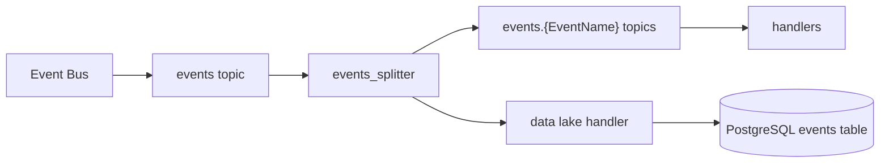

# Data Lake

## Purpose

Store all events from Pub/Sub in raw format to enable replaying for:
- Rebuilding/migrating read models
- Fixing bugs in read model logic
- Building new read models from historical events

## Key Principles

- **Events are immutable facts** - read-only, never modify
- **Schema is contract** - changes affect all consumers
- Database integration is acceptable (shared access is fine)

## Storage Options

- **Large scale (TB+)**: BigQuery, Redshift, ClickHouse, Hadoop
- **Small scale (<1TB)**: PostgreSQL is sufficient to start

## Considerations

- Proprietary solutions risk vendor lock-in
- Self-hosting at scale is complex
- Avoid premature optimization - start simple

## Event Routing Architecture

### Central Events Topic

All events are published to a single `events` topic rather than per-event topics. This ensures no events are missed when forwarding to the data lake.

### Events Splitter Pattern

A forwarder handler subscribes to the central topic and routes events to per-event topics (e.g., `events.TicketBookingConfirmed`) for individual handlers.

Use a raw message handler instead of typed event handlers - no need to unmarshal events when just forwarding. Extract the event name from message metadata.

### Consumer Groups

The splitter must use a consumer group to prevent duplicate processing when scaling horizontally. Without a consumer group, each service instance receives all messages, causing duplicates. With a consumer group, messages are distributed across instances.

## Storing Events

### Schema

Store minimal metadata alongside the raw payload:
- `event_id` - unique identifier (UUID)
- `published_at` - timestamp
- `event_name` - event type for filtering
- `event_payload` - raw JSON

### Data Lake Handler

Uses a **separate consumer group** from the splitter - both subscribe to the same `events` topic but process independently. Only extract the header for metadata; store the full payload as-is.

### Deduplication

Use upsert with conflict resolution (e.g., `ON CONFLICT DO NOTHING`) to handle at-least-once delivery semantics.

## Event Flow

## Additional Resources

Data lakes have many use cases beyond read model migration. Here are some materials to learn more:

- [Data Lake - Martin Fowler](https://martinfowler.com/bliki/DataLake.html) - Understanding the concept, benefits, and potential pitfalls. Emphasizes maintaining data quality to prevent a "data swamp".

- [Data Lakes 101: Overview](https://www.dataversity.net/data-lakes-101-overview/) - Overview of data lakes, their origin, benefits, and uses. Highlights storing all data types, multi-user support, and cost-effective storage.

- [Azure Data Lake Guide](https://learn.microsoft.com/en-us/azure/architecture/data-guide/scenarios/data-lake) - Comprehensive guide on implementing a data lake in Azure, covering architecture, components, and best practices.

- [AWS: What is a Data Lake?](https://aws.amazon.com/big-data/datalakes-and-analytics/what-is-a-data-lake/) - Introduction to data lakes and how AWS can build secure, scalable, and cost-effective solutions.

- [Google Cloud: What is a Data Lake?](https://cloud.google.com/learn/what-is-a-data-lake) - Understanding data lake structure, functions, and potential uses for managing big data.
