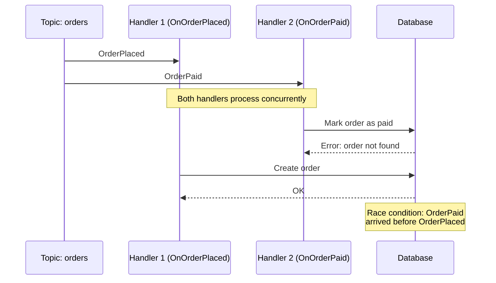
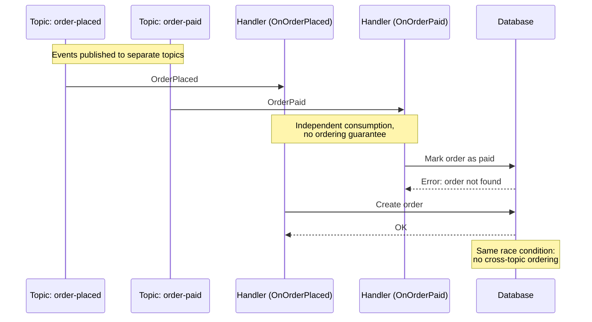
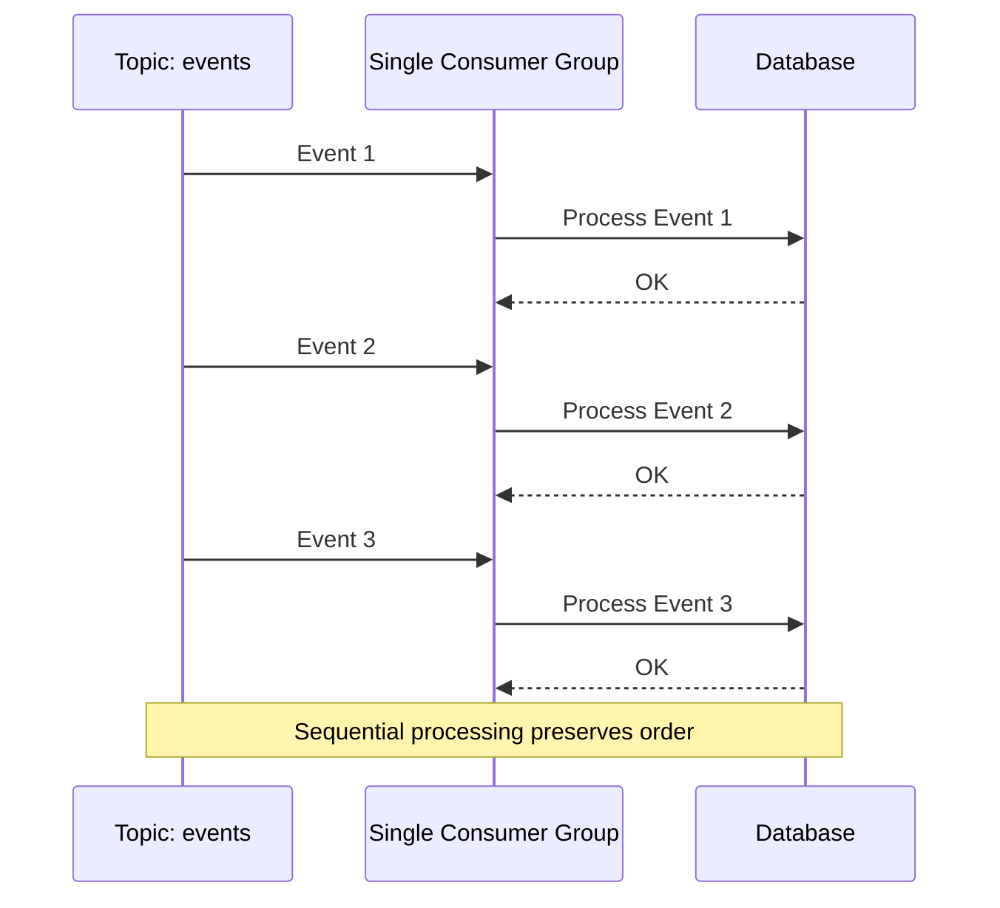
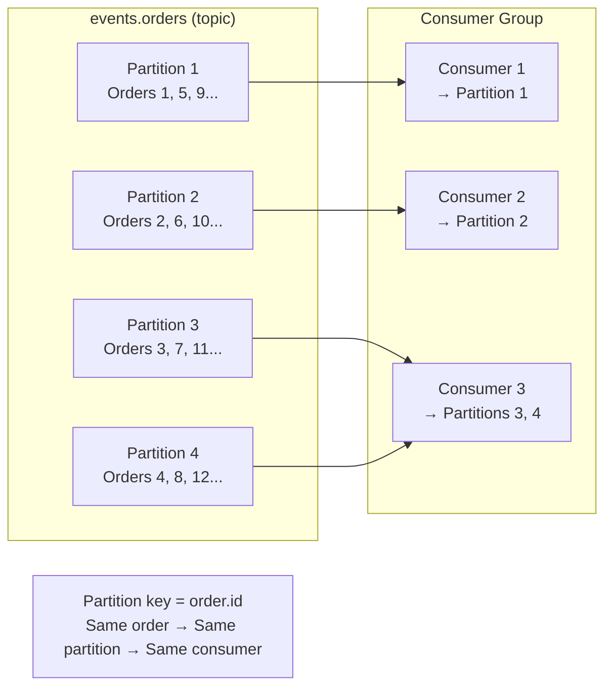
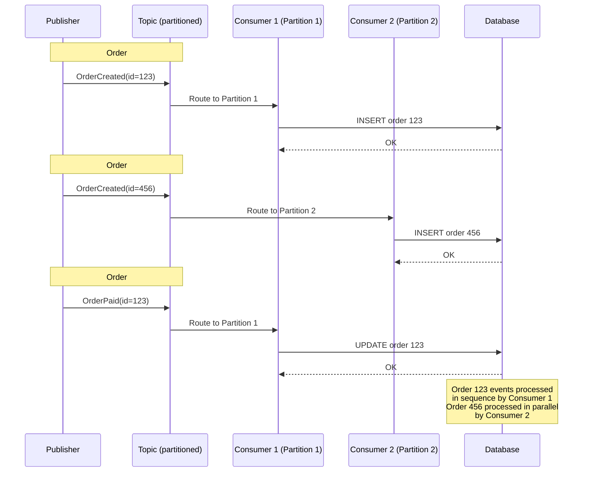

# Message Ordering in Event-Driven Systems

## The Trade-off

Message ordering is a trade-off between **availability** and **consistency**:

| Sequential Processing | No Ordering |
|-----------------------|-------------|
| ✅ Guaranteed ordering | ❌ Out-of-order possible |
| ✅ Simpler reasoning | ❌ More complex logic |
| ❌ Low throughput (1 msg at a time) | ✅ High throughput |
| ❌ One bad msg blocks all | ✅ Failures isolated |

## When Ordering Matters

### 1. Not Critical (Retries Fix It)

**Events**: `OrderPlaced` → `OrderPaid`

If `OrderPaid` arrives before `OrderPlaced`, the invoice service errors and retries. Once `OrderPlaced` arrives, retry succeeds.

```
OrderPaid → Error → Retry → OK (after OrderPlaced arrives)
```

**Key**: Transient dependencies can be resolved with retries.

### 2. Critical (Data Loss Occurs)

**Event**: `ProductUpdated` (contains full product state)

If newer `ProductUpdated` arrives first, then older one overwrites it → data loss.

```
ProductUpdated(Newer) → DB updated to v2
ProductUpdated(Older) → DB reverts to v1 ❌
```

**Key**: Full-state updates require ordering to prevent data corruption.

## How Does This Happen?

### 1. Horizontal Scaling

Multiple service instances processing messages in parallel. The event sent later may finish processing first.

```
Instance 1: Event 1 (slow) → finishes at t=100ms
Instance 2: Event 2 (fast) → finishes at t=50ms
Result: Event 2 processed before Event 1
```

**Note**: Every Pub/Sub has different ordering guarantees. Know yours.

### 2. Error Handling & Retries

Failed messages retried with delay can arrive after newer messages.

```
Event 1 fails → retry after 5s
Event 2 arrives → processed immediately
Event 1 (retry) → processed after Event 2 ❌
```

Immediate retries at queue head preserve ordering but block all messages.

### 3. Other Factors

- Network latency variance
- Partition rebalancing
- Multiple publishers
- Dead letter queues

## Solutions

### Single Topic with Dispatcher

To preserve ordering across multiple event types, use a single topic with one consumer group and a dispatcher pattern.

**Key Principles:**
- All ordered events go to one topic
- Single consumer group ensures sequential processing
- Dispatcher routes messages to handlers based on event type

**Why separate topics/handlers break ordering:**

Separate handlers (same topic) process concurrently:



Separate topics have independent ordering (no cross-topic guarantees):



**Dispatcher pattern maintains order:**



**Trade-offs:**
- ✅ Guaranteed ordering
- ✅ Simpler reasoning about state
- ❌ Lower throughput (sequential processing)
- ❌ Dispatcher receives all events, even irrelevant ones

**Implementation:** Use `EventGroupProcessor` with a handler group that processes events sequentially and dispatches based on event type metadata.

### Partition per Entity

The single-topic dispatcher approach has limitations:
- All handlers receive all events (even irrelevant ones)
- One failed event blocks processing for all entities
- Cannot scale processing (only one message at a time)

**Partitioning** allows parallel processing while maintaining ordering per entity.

**Key Concepts:**
- **Partition**: A topic split into multiple ordered queues
- **Partition Key**: Metadata field (e.g., `entity_id`, `order_id`) that routes all events for the same entity to the same partition
- **Ordering Guarantee**: Messages within a partition are delivered in order
- **Scaling**: Multiple consumers can process different partitions concurrently



**How it works:**

1. **Publisher sets partition key** from message metadata (e.g., `order_id`)
2. **Hash function** maps the key to a specific partition
3. **All events for the same entity** always route to the same partition
4. **One consumer per partition** ensures sequential processing per entity
5. **Different entities** can be processed in parallel



**Trade-offs:**
- ✅ Guaranteed ordering per entity
- ✅ High throughput (parallel processing across entities)
- ✅ Failed events only block their own partition
- ✅ Consumers only receive relevant events (for their partitions)
- ❌ More complex setup (partitioning strategy)
- ❌ Requires choosing partition key carefully
- ❌ Imbalanced partitions if key distribution is skewed

**Implementation:** Configure the publisher with a partitioning marshaler that extracts the entity ID from message metadata:

```go
pub, err := kafka.NewPublisher(kafka.PublisherConfig{
    Brokers: []string{kafkaAddr},
    Marshaler: kafka.NewWithPartitioningMarshaler(func(topic string, msg *message.Message) (string, error) {
        return msg.Metadata.Get("entity_id"), nil
    }),
}, logger)
```

### Entity Versioning

**Entity versioning** adds a sequence number to each event that is incremented with every state change. The consumer validates that events are processed in the correct version order, rejecting out-of-order events.

**How it works:**

1. **Publisher adds version** to each event (e.g., `ProductUpdated{Version: 5}`)
2. **Consumer stores current version** alongside the entity state
3. **On event arrival**, check if `event.Version == stored.Version + 1`
4. **If invalid**, nack/retry the event and wait for the correct version
5. **If valid**, process the event and update the stored version

**When processing latest-only data**, consumers can ignore stale events (where `event.Version <= stored.Version`) instead of retrying.

```go
if event.Version != product.Version + 1 {
    if event.Version <= product.Version {
        // Stale event, already have newer data
        return nil // Ack and ignore
    }
    // Future event, nack and retry
    return errors.New("waiting for intermediate version")
}
```

**Trade-offs:**
- ✅ Works with any Pub/Sub (no ordering guarantees required)
- ✅ Prevents data corruption from out-of-order full-state updates
- ✅ Flexible handling (retry or ignore stale events)
- ❌ Requires persistent version storage
- ❌ Adds complexity to event handlers
- ❌ Retry delays can accumulate during disorder
- ❌ Not suitable for transient dependencies (use retries instead)

**Best for:** Full-state update events where older versions must not overwrite newer ones, such as `ProductUpdated`, `ProfileChanged`, or `ConfigurationModified`.

### Independent Updates

**Independent updates** avoids ordering problems by designing read models so each event updates different, non-overlapping fields. Instead of events competing to update the same state field, each event writes to its own independent field.

**Example:** An Order with a single `status` field updated by multiple events can be corrupted if `OrderShipped` arrives before `OrderPaid`. Instead, use independent fields: `paid_at`, `shipped_at`, `refunded_at`. Out-of-order events no longer corrupt state since each field is only written by one event type.

If you need a computed `status` field for queries, derive it on read by comparing the timestamps.

**Trade-offs:**
- ✅ No ordering constraints required
- ✅ Works with any Pub/Sub system
- ✅ High throughput (no sequential processing)
- ✅ Failures isolated per event type
- ✅ Simple to implement and reason about
- ✅ Full audit trail (all timestamps preserved)
- ❌ Requires schema changes (more fields)
- ❌ Computed fields add read-time complexity
- ❌ May require migrations for existing data

**Best for:** State machines where events represent transitions, timestamp tracking, multi-status entities where events represent independent facts.

**Not suitable for:** Full-state updates where events contain complete entity snapshots, sequential workflows where each step depends on the previous, scenarios requiring rollback of previous state changes.

**Key Design Principle:** Don't let events overwrite data that could be updated by other events. Each event should append its own facts to the read model, not replace state that other events care about.

## Tips

### Avoid Over-Engineering

Not every solution needs to be elegant and generic. We've seen simple problems solved in complicated ways because the simple approach wasn't "the right way." Ask: "Is this really needed now?" If the decision is easily reversible, start simple and refactor later. You're paid for working, maintainable software.

### Message Broker Migration

We solved the ordering problem without changing brokers, but migration may be beneficial. We've seen companies use RabbitMQ at scale when it wasn't stable enough. Consider migration costs vs. benefits. Technology consolidation simplifies operations. If benefits outweigh costs, start with message forwarding between brokers as an experiment, then switch.