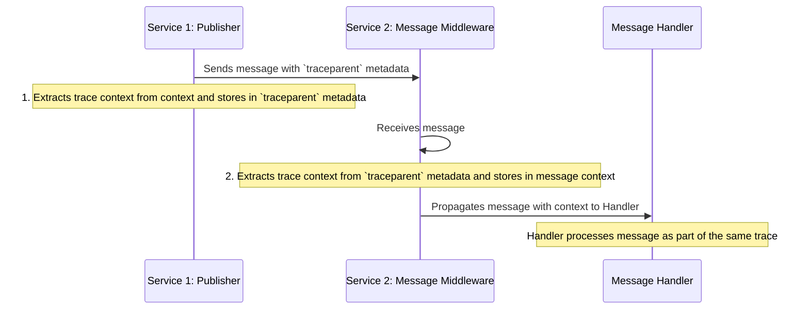

# Distributed Tracing

## Why Tracing Matters

Event-driven systems are hard to debug because operations span multiple services. Distributed tracing correlates all related operations—even across service boundaries—into a single trace.

**Key benefit**: By knowing a trace ID, you can see what triggered an event and everything that event caused downstream.

## Core Concepts

| Term | Description |
|------|-------------|
| **Trace** | A group of spans sharing the same trace ID |
| **Span** | A single operation (HTTP request, DB query, message processing) with start/end times, attributes, and parent span ID |
| **Exporter** | Sends traces to backends (Jaeger, AWS X-Ray, GCP Stack Driver) |
| **Propagator** | Serializes/deserializes trace context between services |
| **Sampling** | Reduces trace volume—don't trace everything in production |

## OpenTelemetry

We use [OpenTelemetry](https://opentelemetry.io/)—the successor to OpenCensus and OpenTracing. Exporters are pluggable: use Jaeger locally, cloud solutions in production.

## Span Best Practices

- Use spans for meaningfully long operations, not single function calls
- Add relevant attributes (user ID, order ID, etc.) for debugging
- Common span operations: HTTP requests, DB queries, message send/receive

## Span Attributes

Attributes are key/value pairs attached to spans that store useful context. Examples: request URL, user ID, HTTP status. High-cardinality attributes are not a problem (unlike metrics).

### Adding Attributes

```go
import (
    "go.opentelemetry.io/otel"
    "go.opentelemetry.io/otel/attribute"
)

// When creating the span
ctx, span := otel.Tracer("").Start(
    ctx,
    "AddUser",
    trace.WithAttributes(
        attribute.String("userID", userID),
    ),
)

// Or add later
span.SetAttributes(
    attribute.String("userID", userID),
)
```

### Error Handling

Mark spans as errors so the tracing UI can highlight failures:

```go
import "go.opentelemetry.io/otel/codes"

defer func() {
    if err != nil {
        span.RecordError(err)
        span.SetStatus(codes.Error, err.Error())
    }
}()
```

## Trace Propagation

`context.Context` isn't serializable across service boundaries. To correlate traces across services, we serialize trace/span IDs into message metadata using the [W3C Trace Context](https://www.w3.org/TR/trace-context/) standard (`traceparent` metadata).

### How It Works

1. **Publisher**: Extract trace ID and parent span ID from context, store in message's `traceparent` metadata
2. **Message Middleware**: Extract trace ID and parent span ID from `traceparent` metadata, store in message context



## Tracing Beyond Messages

While we've focused on message tracing, other operations are worth instrumenting.

### Exposing the Trace ID

Knowing the trace ID helps correlate logs with traces. Extract it from context:

```go
traceID := trace.SpanContextFromContext(ctx).TraceID().String()
```

**Pro tip**: Use the trace ID as your correlation ID to simplify service logic and eliminate separate correlation ID propagation.

### Adding HTTP Requests to Traces

Instrument outgoing HTTP requests to see them in traces and propagate context to downstream services:

```go
import "go.opentelemetry.io/contrib/instrumentation/net/http/otelhttp"

client := &http.Client{
    Transport: otelhttp.NewTransport(http.DefaultTransport),
}
```

This automatically adds the `traceparent` header to outgoing requests—useful when calling your own services.

### Adding SQL Queries to Traces

SQL queries in traces help debug performance issues. Use [otelsql](https://github.com/XSAM/otelsql):

```go
import "github.com/XSAM/otelsql"

db, err := otelsql.Open("postgres", dsn)
```

## Learn More

- [OpenTelemetry Concepts](https://opentelemetry.io/docs/concepts/)
- [OpenTelemetry Glossary](https://opentelemetry.io/docs/concepts/glossary/)
